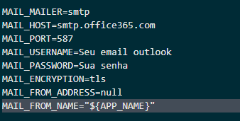

## Sobre Consulvivo

Consulvivo é um projeto para marcação de consultas e aprovação das mesmas pelos médicos responsaveis

## Configurações e instalações

* Instale as dependencias do projeto
  * composer install
* Configuração de banco de dados
  * php artisan migrate
* Configuração do disparo de emails
  * Insira as credencias e autenticação do email para realizar o disparo. Para a criação do projeto, foi usado o outlook, segue as configurações para o outlook
  * 
  *
